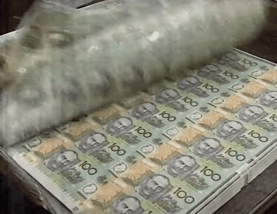
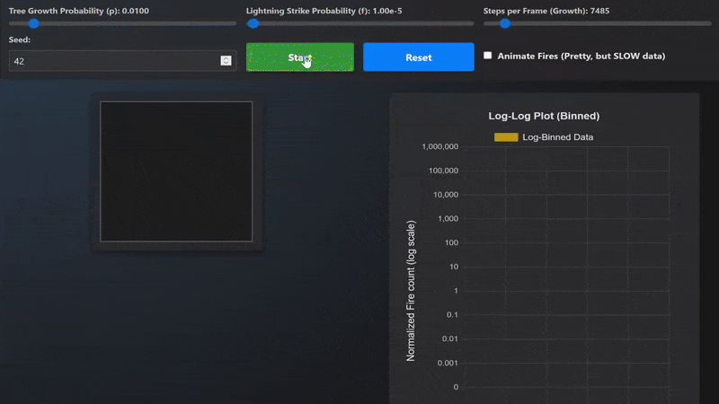
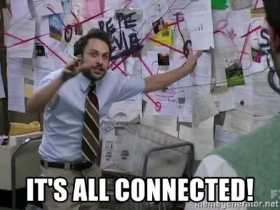

import CoinFlipGameA from "../../components/CoinFlipGameA.jsx";
import CoinFlipGameB from "../../components/CoinFlipGameB.jsx";

_**Disclaimers**: This post is heavily inspired by the excellent [Veritasium](https://www.veritasium.com/) video about Power Laws. I highly recommend watching it [here](https://www.youtube.com/watch?v=HBluLfX2F_k) (and their other videos too)._

## How good is your intuition about risk and reward? 
How do you reason about uncertainty? About rare events?

Let's play 2 games and see which one you prefer.

<CoinFlipGameA client:load />

<CoinFlipGameB client:load />

The first game is boring, right? You get a small and almost guaranteed reward. Play 100 times, and you will most likely never won more than 75$ in one game.

On the other hand, the second game is nerve-wracking! Sometimes you break the bank with a huge win, sometimes you don't. How does you feel about it?

## The Power Law (the light math part)

The first game has a **normal distribution** of rewards. Most of the time you get around the average reward, and the probability of getting a much higher reward drops off quickly.

The rewards from the second game follow a **power law distribution**. Most of the time you get a small reward, but there is a slim chance of getting a huge reward. The probability of getting a reward decreases as the reward increases. But it does so in a way that still increases the overall expected value of the game. If you consider all the possible reward, even the most unlikely, the **expected value** (EV) of the second game (with a fair coin) is infinite! 

Think about it for a few seconds... The EV is not just BIG, it is **infinite**! It means that the rationale thing to do is to keep playing the game forever, even if you have to pay 10$ to play each time! Even if you have to pay 100$... even if you have to pay 1M$! The fee doesn't actually matter... (as long as you have infinite money to keep playing).

## What's the point?

Many real-world phenomena follow distributions similar to power laws: wealth distribution, earthquake magnitudes, forest fire sizes, and more. 

Let's explore a terrific simulation Veritasium made to illustrate this: Forest fires model (Drossel–Schwabl)

In this simulation, trees grow and occasionally catch fire. Most fires are small, but occasionally, a lightning strike can cause a massive fire that burns a significant portion of the forest. In fact, the distribution of the fire sizes follow a power law.

Play with it [here](https://www.veritasium.com/simulation5). It's more fun than what it looks like.

There are a few other notable examples of power laws in real life:
- [Sand piles collapsing (simulation)](https://www.veritasium.com/simulation3): Sand grains are added one by one to a pile until it reaches a critical state, leading to avalanches of various sizes. The sizes of these avalanches follow a power law distribution.
- [Wealth distribution (resource from the University of Florida)](https://web.mae.ufl.edu/uhk/PARETO.pdf): "Pareto proposed via statistical analysis
that 80% of a countries wealth is held by about 20% of the people".
- [Stock market returns](https://blogs.cornell.edu/info2040/2017/11/27/applying-power-laws-to-stock-markets/)
- [War casualties](https://bpb-us-e1.wpmucdn.com/sites.dartmouth.edu/dist/0/433/files/2014/07/friedman_-_using_power_laws_-_jcr_2014.pdf)
- ...

## But why are they appearing "everywhere"? 

Some says power laws emerge from **self-organized criticality**. Systems evolve to a **critical state** (trees grow, sand piles accumulate, ...) where minor events can lead to consequences of any sizes.

This idea was very much developped by Per Bak, Chao Tang and Kurt Wiesenfield in [their 1987 paper](https://psychsafety.com/wp-content/uploads/2025/04/SOC.pdf)

**Once you know about "self-organized criticality", you start to see it everywwhere, especially when humans are involved.**
- **Many people accumulate unadressed emotions over time and minor events can trigger massive emotional outbursts.**
- **Companies accumulate technical and organisational complexity and minor incidents or mistakes can lead to [catastrophic failures](https://aws.amazon.com/message/101925/).**
- **Societies accumulate tensions and minor events (a small fuel tax increase) can spark large-scale outrage ([Gilet jaunes mouvement](https://www.lemonde.fr/societe/article/2019/03/18/gilets-jaunes-l-usage-de-la-violence-est-toujours-un-calcul-risque_5437952_3224.html)) (If you are from the USA, consider the impact of the death of George Floyd).**
- **Our economic system creates business opportunities over time. It's quite similar to the forest in the simulation above that keeps creating trees. And every new product launch, every startup creation is a lightning strike. Some stays small, some completly changes the landscape.**

## What's the point?

Real life™ is more complex than what we are comfortable with. Using this newly acquired knowledge to guide every choices you make is as bad of an idea as learning history to predict the future.

**BUT** if history never repeats itself, it often rhymes.

What actionable insights can we draw from this knowledge about power laws and self-organized criticality?

1. **The number of tosses** matters. This is what online coaches mean when they say "create your own luck" or some variant of it. This is partially why your network is so valuable. The more exposure you have, the more tosses you are susceptible to take part in.
2. As nobody has inifinite resources to keep playing (time, money, energy), any edge available to improve your odds is worth much more than what you think (try my mini-games again to see it in action). Use all your wisdom, all your intuition, all your experiences so that the coin you are considering to flip has more than 50% chance to land on heads.
3. Most attempts will fail. There is no way around it. Being at peace with failure seems like a requirement to play the game.

This blog post and this website were motivated by this very idea. This is one of my first tosses. I'll let you know how it goes.