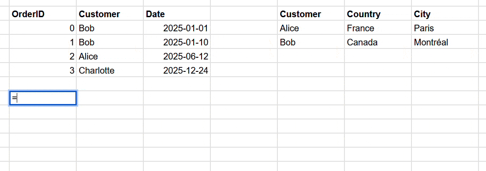
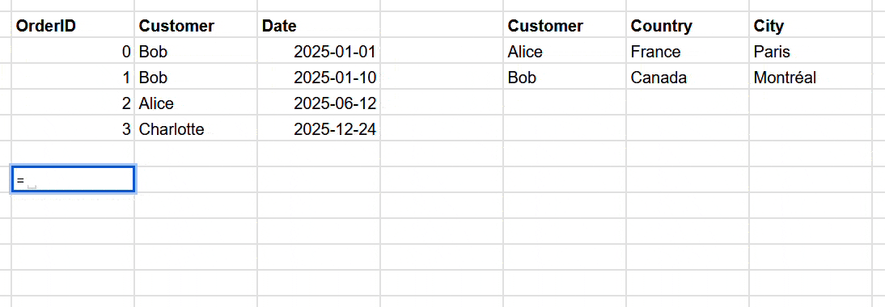

Have you ever dreamed of using SQL JOINs directly within Google Sheets™? Well, I have.



As simple as 
```c
=SQLJOIN(B6:D10, F6:H8, 2, 1)
```
 _(`2` and `1` are the columns to join on in the left and right tables resp.)_

Combine it with the [`QUERY`](https://support.google.com/docs/answer/3093343?hl=en) builtin function that provides SQL-like querying capabilities (``SELECT``, ``WHERE``, ``GROUP BY``, etc.) and you have the power of SQL where you need it.



```c
=QUERY(SQLJOIN(B2:D6,F2:H4,2,1), "SELECT Col4, MAX(Col3) GROUP BY Col4")
```
Do you start to feel it?

---
## How to use it?

Install the extension in your Google Sheets™ by going to `Extensions` -> `Add-ons` -> `Get add-ons`. Search for `SQLJOIN`, find the following logo,


Click install then follow the instructions.

Then, just do:

```c
=SQLJOIN(B6:D10, F6:H8, 2, 1)
```

Specify the left range (or table), the right range (or table), and tell it which columns to join on. Adding or removing columns in either table doesn’t require updating the formula. 

Doing **multiple joins** is as simple as nesting `SQLJOIN` calls.

```c
=SQLJOIN(SQLJOIN(B6:D10, F6:H8, 2, 1), J6:L9, 3, 1)
```

You can **join on multiple columns** by providing arrays as the third and fourth arguments.

```c
=SQLJOIN(B6:D10, F6:H8, {2,3}, {1,2})
```

You can also **specify the type of join** (INNER, LEFT) as an optional fifth argument. Default is INNER.

```c
=SQLJOIN(B6:D10, F6:H8, 2, 1, "LEFT")
```

It also **works on Google Sheets™ tables**

```c
=SQLJOIN(Table1[#ALL], Table2[#ALL], 2, 1) // Don't forget the #ALL to include headers
```

It even works with **unbounded ranges** (tables that grow/shrink dynamically).

```c
=SQLJOIN(B6:D, F6:H, 2, 1)
```

If your ranges doesn't have headers, set the fifth argument to `FALSE` to indicate that there are no headers.

```c
=SQLJOIN(B6:D, F6:H, 2, 1, FALSE)
```

---
## But why?

There is no convenient way to achieve proper SQL-like JOINs in Google Sheets™ natively. This is such a weird state of affairs, I am still worried that I missed something obvious.

The contenters are:
- Using `VLOOKUP`, `HLOOKUP`, `XLOOKUP` (or even `INDEX`+`MATCH`) functions. You need a formula in every cell. Beware of what happens when rows are added or removed. 
- Using these `LOOKUP` functions in combination with `ARRAYFORMULA` can help a bit, but it is cumbersome, especially when you need to join multiple columns or multiple tables.
- Using `SQLJOIN` custom function. One formula to rule them all, easy to maintain, easy to read.

Let's compare these approaches with 3 different scenarios:
1. Left Joining 2 tables (`Sheets1!A:D` and `Sheets2!A:D`) on a single column (column A in both tables)
2. Left Joining 2 tables on multiple columns (`Sheets1!A:D` and `Sheets2!A:D`, column A and B in both tables)
3. Left Joining 3 tables (`Sheets1!A:D`, `Sheets2!A:D` and `Sheets3!A:D`) on a single column (`Sheets1!A` <=> `Sheets2!A` and `Sheets2!B` <=> `Sheets3!B`)

### 1. Left Joining 2 tables on a single column

Here we are trying to left join `Sheets1!A:D` with `Sheets2!A:D` on column A. Bringing in all columns from `Sheets1` and columns B, C and D from `Sheets2` in a new sheet.

**Using VLOOKUP/XLOOKUP:**
You need a formula in every cell of the result table. For example:
```c
=Sheets1!A2  // In cell A2 to copy from Sheets1
=Sheets1!B2  // In cell B2 to copy from Sheets1
...
=VLOOKUP(Sheets1!$A2, Sheets2!$A:$D, 2, FALSE)  // In cell E2 to get the first matched column
=VLOOKUP(Sheets1!$A2, Sheets2!$A:$D, 3, FALSE)  // In cell F2 to get the second matched column
```
Then drag these formulas down for every row and deal with the headers. Beware of what happens when rows are added or removed in either table.

**Using ARRAYFORMULA + VLOOKUP:**
Slightly better, you can use a single formula:
```c
=ARRAYFORMULA({Sheets1!A2:D, VLOOKUP(Sheets1!A2:A, Sheets2!A2:D, {2,3,4}, FALSE)})
```
Adding rows works automatically, but adding columns to `Sheets2` still requires updating the column indices `{2,3,4}`. Headers are not handled automatically.

**Using SQLJOIN ✨:**
```c
=SQLJOIN(Sheets1!A:D, Sheets2!A:D, 1, 1, "LEFT")
```
The formula is simple, easy to read, and easy to maintain. Adding/removing columns in either table does not require updating the formula. Adding rows works automatically. Headers are handled automatically, but can be easily added with a separate header row.

### 2. Left Joining 2 tables on multiple columns

Here we are trying to do the same (i.e.left join `Sheets1!A:D` with `Sheets2!A:D`) buth this time **we need to join on 2 columns: A and B**. 

**Using VLOOKUP/XLOOKUP:**
Not directly possible. You need to concatenate columns as string using `&` operators and a separator (e.g. `♦` below) then use a combination VLOOKUP and ARRAYFORMULA to achieve the join:
```c
=Sheets1!A2  // In cell A2 to copy from Sheets1
=Sheets1!B2  // In cell B2 to copy from Sheets1
...
=VLOOKUP(Sheets1!$A2 & "♦" & Sheets1!$B2, ARRAYFORMULA({Sheets2!A2:A & "♦" & Sheets2!B2:B, Sheets2!C2:D}), 2, FALSE)   // In cell E2 to get the first matched column
=VLOOKUP(Sheets1!$A2 & "♦" & Sheets1!$B2, ARRAYFORMULA({Sheets2!A2:A & "♦" & Sheets2!B2:B, Sheets2!C2:D}), 3, FALSE)  // In cell F2 to get the second matched column
```
It's possible to avoid using `ARRAYFORMULA` by creating a helper column in `Sheets2` that concatenates the join columns, but new column needs to be the first column in the range used for VLOOKUP, meaning even more hassle and weird constraints to work with. 

**Using ARRAYFORMULA + VLOOKUP:**
Requires complex nested formulas:
```c
=ARRAYFORMULA(
  {
    Sheets1!A2:D, 
    VLOOKUP(
      Sheets1!A2:A & "♦" & Sheets1!B2:B,
      {Sheets2!A2:A & "♦" & Sheets2!B2:B, Sheets2!C2:D},
      {2, 3},
      FALSE
    )
})
```
While being cleaner, this formula starts to be hard to debug. What the odds that you'll remember this syntax in 6 months when you need to update it?

**Using SQLJOIN ✨:**
```c
=SQLJOIN(Sheets1!A:D, Sheets2!A:D, {2,3}, {2,3}, "LEFT")
```
Once again, this is easy to read and maintain. Adding/removing columns in either table does not require updating the formula. Headers are handled automatically.

### 3. Left Joining 3 tables on a single column

Here we are trying to left join 3 tables: `Sheets1!A:D`, `Sheets2!A:D` and `Sheets3!A:D`. `Sheets1` with `Sheets2` need to be join on their respective column A, while `Sheets2` and `Sheets3` need to be join on their respective column B.

**Using VLOOKUP/XLOOKUP:**
Nightmare scenario. You need VLOOKUP formulas for the second table, then more VLOOKUP formulas referencing those results for the third table.

**Using ARRAYFORMULA + VLOOKUP:**
First you need to modify the `Sheets3` so that the column B used for joining is the first column. Let's say you create a helper range like this:
```c
=ARRAYFORMULA({Sheets3!A2:A} // In cell E1 in Sheets3
```

Then you can do:
```c
=ARRAYFORMULA({Sheets1!A2:D, VLOOKUP(Sheets1!A2:A, {Sheets2!A2:D, VLOOKUP(Sheets2!B2:B, Sheets3!B:E, {4, 2, 3,}, FALSE)}, {2,3,4, 5, 6, 7}, FALSE)})
```
This formula is getting out of hand. Debugging it will be a nightmare. Any change in any of the 3 tables will likely require updating multiple parts of this formula.

**Using SQLJOIN ✨:**
```c
=SQLJOIN(Sheets1!A:D, SQLJOIN(Sheets2!A:D, Sheets3!A:D, 2, 2, "LEFT"), 1, 1, "LEFT")
```
Clear nesting pattern. Each join is explicit and easy to understand. Adding a fourth table? Just nest another SQLJOIN. No column indices to update when tables evolve.

<br>
<br>

**And that's just `LEFT JOIN`! Doing `INNER JOIN` without `SQLJOIN` require even more complex formulas (with `QUERY` or `IFERROR`).**

---
## Known limitations

- Custom functions have an overhead (due to serialization/deserialization and Apps Script™ execution time). Even for small tables, expect a few seconds of delay.
- Only `INNER JOIN` and `LEFT JOIN` are supported. No `RIGHT JOIN` or `FULL JOIN`.
- No support for advanced SQL features (e.g., `ON` conditions with inequalities, `USING` clause, etc.).

---
## Privacy Policy
See [here](https://silvestreperret.com/legal#privacy)

---
## Source & Support
The source code is available (MIT license, i.e. it's free & open source) on [GitHub](https://github.com/SilvestrePerret/google-sheets-join).

If you find any issues or have suggestions, please [open an issue on GitHub](https://github.com/SilvestrePerret/google-sheets-join/issues).
